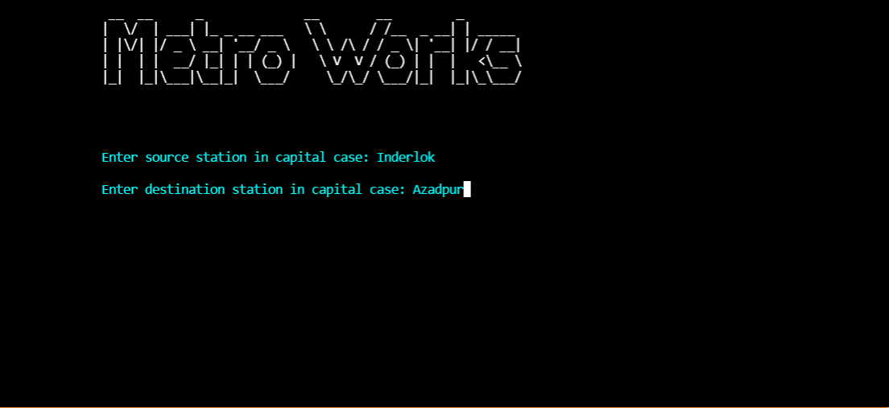

<p align="center">
  
</p>


## :ledger: Index

- [About](#beginner-about)
- [Usage](#zap-usage)
  - [Installation](#electric_plug-installation)
  - [Tools](#package-tools)
  - [Commands](#electric_plug-commands)
- [Resources](#page_facing_up-resources)
- [Gallery](#camera-gallery)
- [Credit/Acknowledgment](#star2-creditacknowledgment)
- [License](#lock-license)

##  :beginner: About
Metroworks in an application meant for linux users, It helps you find & visualize the Shortest Path between Delhi Metro Stations, it uses Graph Data Structure & Dijkstra's Algorithm.

## :zap: Usage
To use this project.

###  :electric_plug: Installation
- Install dependencies & export environment variables.

```bash
$ sudo apt-get install graphviz 
$ sudo apt-get install fim
$ sudo apt-get install zenity
$ sudo apt-get install sl
$ sudo apt-get install notify-osd 
```
###  :package: Tools
  - [graphviz](http://www.graphviz.org/)
  - [fim](http://manpages.ubuntu.com/manpages/xenial/man1/fim.1.html)
  - [zenity](https://packages.ubuntu.com/trusty/gnome/zenity) 
  - [sl](http://manpages.ubuntu.com/manpages/trusty/man6/sl.6.html)
  - [notify-send](http://manpages.ubuntu.com/manpages/xenial/man1/notify-send.1.html) 

###  :electric_plug: Commands
- Start project using
```bash
$ g++ -std=c++11 metroworks.cpp -o metroworks
$ ./metroworks
```


##  :page_facing_up: Resources

- [DMRC](http://www.delhimetrorail.com/)

##  :camera: Gallery
<p align="center">
  <h3> On Startup: </h3>
  
</p>

<p align="center">
  <h3> Entering two stations gives us distance, stations, and fare: </h3>
  
</p>

<p align="center">
  <h3> Shortest route between entered stations: </h3>
  
</p>

<h3> Current Delhi Metro Stations in program: </h3>
<p align="center">
  
</p>


